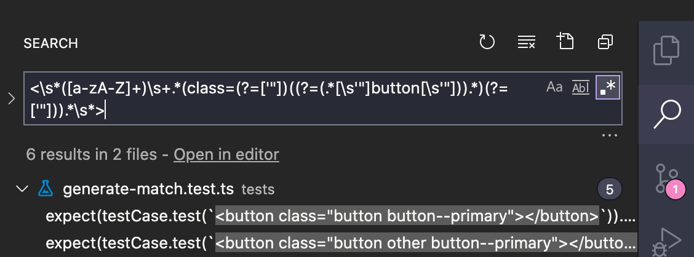

# Selector2Regexp

Generate regular expressions of JavaScript from CSS selectors.
That regular expressions is for searching HTML elements which is matched given CSS selector.

You can try it on the web.  
https://m-yoshiro.github.io/selector2regexp-web/

[](https://badge.fury.io/js/selector-2-regexp)


## Installation

Requires Node.js 18 or later.

```sh
$ npm i selector-2-regexp
```

## Usage

### Basic

```sh
$ s2r '.button'
# => <\s*([a-zA-Z]+)\s+.*(class=(?=['"])((?=(.*[\s'"]button[\s'"])).*)(?=['"])).*\s*>
```

### With clipboard

Saving clipboard is convenient to use with editor, e.g. VS Code.  
After saving clipboard, paste it on a search input of your editor.

1. Save to clipboard.

    ```sh
    # Save to clipboard on macOS (On Windows, Replace "pbcopy" to "clip")
    $ s2r '.button' | pbcopy
    ```

2. Paste a regular expression on your tool

    

### Examples

#### Basics

```sh
# Type Selector
  s2r 'div'

# Class Selector
  s2r '.single'

# Id Selector
  s2r '#app'

# Attribute Selector
  s2r '[hidden]'
  s2r '[data-state=active]'
  s2r '[data-state*=active]'
  s2r '[data-state~=active]'
  s2r '[data-state^=active]'
  s2r '[data-state$=active]'

# href, src
  s2r 'a[href^=https://]'
  s2r 'img[src$=.svg]'

# Multiples
  s2r '.button.button--primary'
  s2r 'div.panel.flex'
```

#### Combinator

```sh
# Descendant combinator
  s2r '.parent .child'

# Child combinator
  s2r '.parent > .child'

# Next sibling combinator
  s2r '.parent + .child'

# General sibling combinator
  s2r '.parent ~ .child'
```

## Supported selectors

### Basic selectors

* Class selector ✅
* ID selector ✅
* Type selector ✅
* Attribute selector ✅


### Combinators

* Descendant combinator ✅
* Child combinator ✅
* General sibling combinator ✅
* Adjacent sibling combinator ✅
* Column combinator ☑️ 😢


## Notes

### With "combinators", a generated regular expression includes ES2018's features.

When given combinators, generated regular expressions that includes `"Lookbehind assertion"` and `"Negative lookbehind assertion"` which are ES2018's features.  

This regular expressions **might not work some environments unsupported them** 😢.  
_(e.g., IE, FireFox and old version Node.js)_  

Please check their statements if you use with combinator.  
https://caniuse.com/#feat=mdn-javascript_builtins_regexp_lookbehind_assertion
